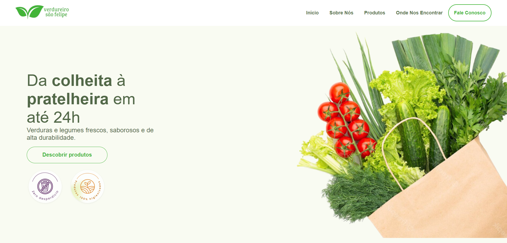
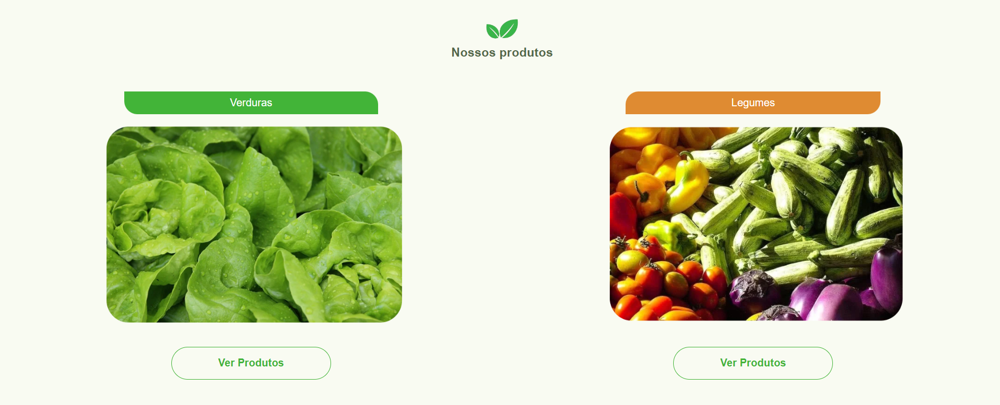
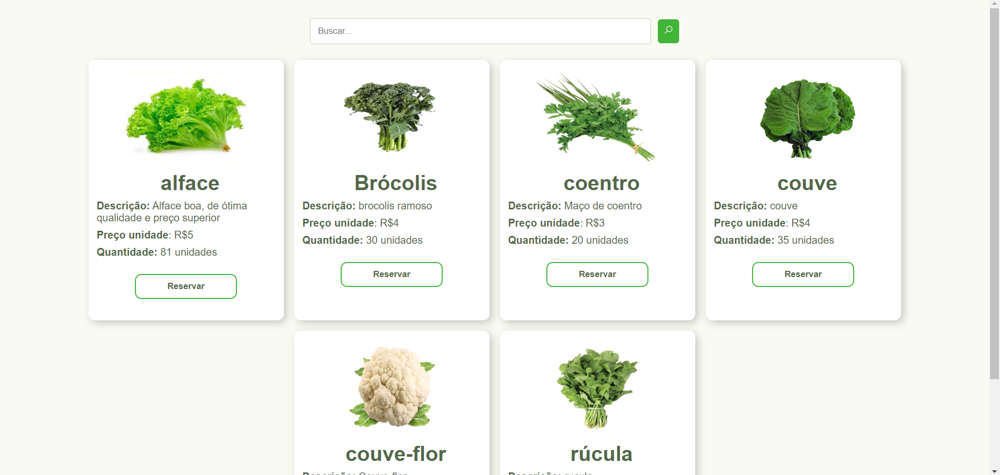
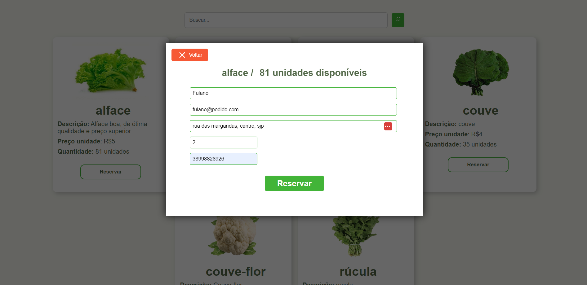

# Verdureiro São Felipe

O "Verdureiro São Felipe" é um projeto familiar que surgiu com o objetivo de criar uma plataforma online para expor e vender produtos agrícolas provenientes da agricultura familiar. Este projeto foi idealizado como uma maneira de conectar diretamente nós produtores rurais  e administradores do sistema do Verdureiro São Felipe com consumidores interessados em alimentos frescos, saudáveis e produzidos de forma sustentável.

A plataforma foi projetada para ser fácil de usar tanto para os nós produtores quanto para os consumidores. Os administradores que podem por meio de seu painel administartivo cadastrar, listar, atualizar e deletar produtos, listar reservas feitas por clentes e gerencia-las de forma simples, enquanto os clientes podem navegar e reservar produtos de maneira intuitiva.

## Tecnologias utilizadas

### React
React é uma biblioteca popular de JavaScript para construir interfaces de usuário, especialmente em aplicações de página única (SPA), onde os dados podem mudar ao longo do tempo. Ela permite que os desenvolvedores criem componentes de UI reutilizáveis que gerenciam seu próprio estado.

### React Toastify
React Toastify é uma biblioteca para criar notificações de toast em aplicações React. Notificações de toast são mensagens pequenas e não intrusivas que aparecem temporariamente na parte inferior (ou superior) da tela para informar os usuários sobre ações ou eventos.

### EmailJS
EmailJS é um serviço que permite enviar e-mails diretamente do seu código JavaScript do lado do cliente. Ele simplifica o processo de envio de e-mails sem a necessidade de configurar um servidor.

## Documentação

### Visão geral

Para começar, o início da página conta com um banner com algumas informações pertinentes. A página é verticalizada, isso indica que o conteúdo é organizado de forma vertical, em oposição à organização horizontal ou em grade. Isso significa que o usuário rola para baixo na página para ver mais conteúdo, em vez de clicar em links ou botões para navegar horizontalmente ou em seções distintas. Peloa Header da página é possível navegar para as demais seções.

Na seção de nossos produtos, temos a divisão entre duas categorias: verduras e legumes.

São listados todos os produtos disponíveis para reserva na página, onde é possível fazer a reserva de cada produto.

As reservas são feitas individualmente para cada produto sendo necessário uma entrada a cada reserva. A finalizar a reserva, só clicar em reservar e prontinho, a reserva estara ativa, o usuário será direcionado para o whatsapp para efetivar a reserva.

## Licença

Este projeto é licenciado sob os termos da Licença MIT. Veja o arquivo [LICENSE](LICENSE) para mais detalhes.
